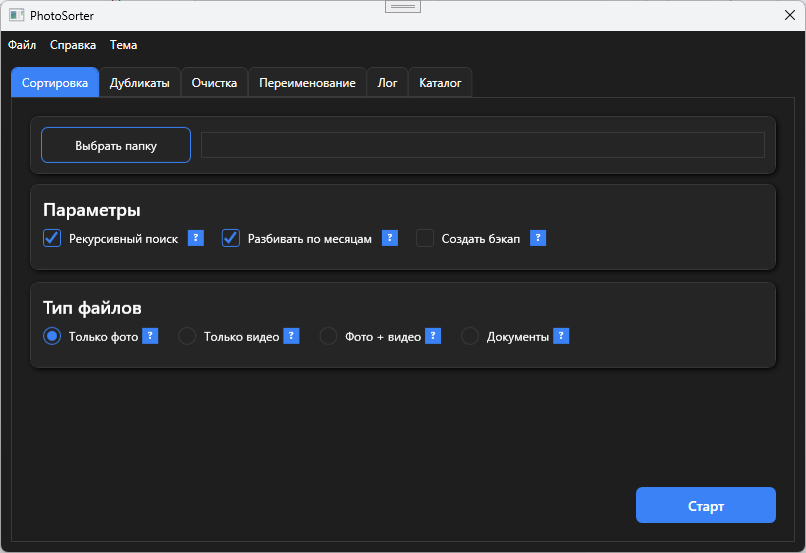
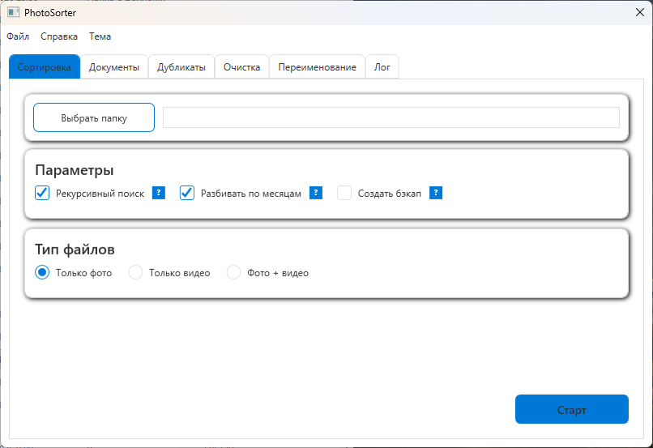

# PhotoSorter

Инструмент для управления фотоархивом: сортировка по дате, поиск дубликатов, очистка мусора и переименование файлов.

## 📥 Установка

1. Скачайте [последнюю версию](https://github.com/Kvant2501/Sorter/releases)
2. Запустите `setup.exe`
3. Следуйте инструкциям мастера установки

## 🎯 Основные функции

- **Сортировка** фотографий по дате съёмки
- **Поиск дубликатов** по содержимому файла
- **Очистка** временных файлов, скриншотов и пустых файлов
- **Переименование** по гибким шаблонам
- Поддержка **темной и светлой тем**

## 🖥️ Системные требования

- Windows 10/11
- .NET 6.0 Runtime (установится автоматически)

## 📜 Лицензия

MIT License — свободное использование и модификация.

## 💬 Поддержка

Если возникли проблемы — [создайте issue](https://github.com/Kvant2501/Sorter/issues) на GitHub.
